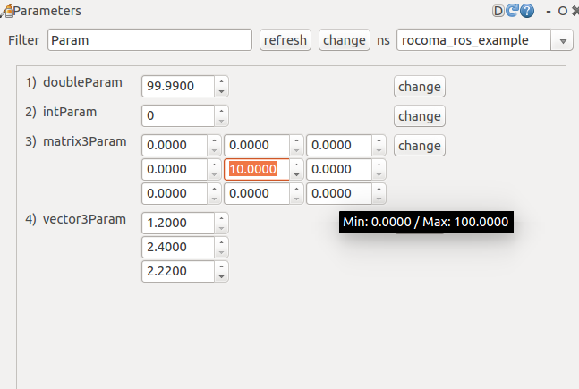

# Parameter Handler RQT GUI

This page documents the legacy Parameter Handler RQT GUI that was used together
with `parameter_handler_ros`.

## Main Controls

- `Filter`: search parameters by name
- `Refresh`: reload parameter information from the handler
- `Change`: apply pending edits for the current selection
- `Namespace`: select the namespace of the parameter handler to edit

The `Namespace` combo box is editable, so additional valid namespaces can be
added manually. All services must exist under that namespace. The GUI stores the
list of namespaces when it closes. Enter `clear` to remove the saved entries.

## Parameter List Entries

Each row in the parameter list contains:

- `Nr`: alphabetical index
- `Name`: parameter name
- `Parameter Value`: one spin box per matrix entry
- `Change`: apply the modified value

Hovering over a value field shows the configured minimum and maximum values.

